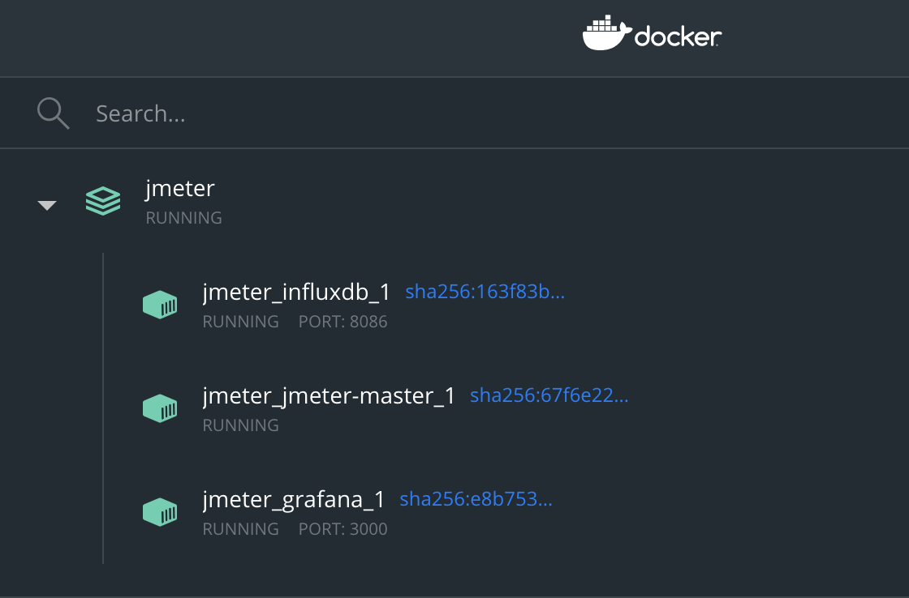
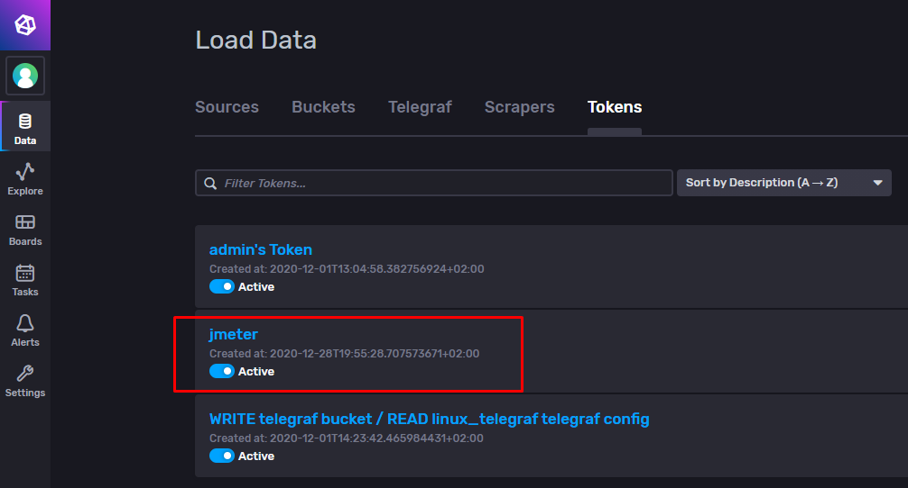
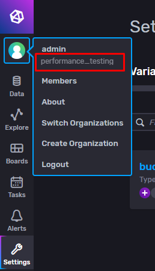
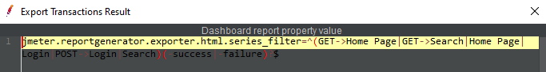
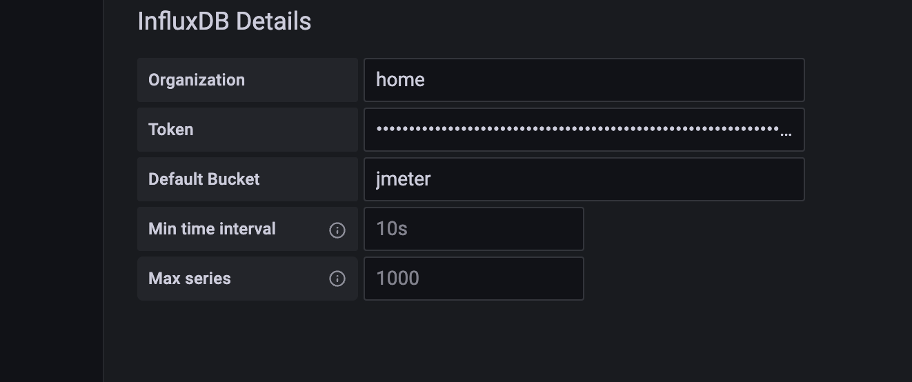

<h1 align="center">Jmeter | InfluxDB v2.0 | Grafana | Docker</h1>
<p>
  
  <a href="/docs">
    
  </a>
  <a href="LICENSE">
    
  </a>
</p>

## About the project
This repository contains everything you need to visualize and analyze the results of JMeter testing.

## How it works:
JMeter has the Backend Listener plugin plugged in that sends metrics to InfluxDB and provides the ability to visualize charts in Grafana, have a summary report as tests run in JMeter. 


## What metrics are we analyzing:
- Number of users;
- Number of queries executed successfully, not successfully;
- Number of OPS/s
- Response code;
- Error message;
- The response body of failed requests;
- Connection time;
- Delay;
- Response time (used from SampleResult.class, necessary for summary report).


Notes: if you need to save the errors you got while the test to csv like file and then share to the dev team you can use the [jmeter-csv-listener-plugin](https://github.com/mderevyankoaqa/jmeter-csv-listener-plugin). 
This plugin can be used while the functional testing and load tests as well.

## Important notes 
🚨 The plugin Backend Listener allows 100 errors happened one by one, then plugin will stop importing the results after that! See details in the logs.
Counter will be refreshed at least you have 4 fails. This is protection to avoid OOM error. 
The option can be configured in the settings (the key name is `influxDBThresholdError` see the Backend Listener configuration for the details). You need to be careful with that option and know the hardware resources to store data in the memory. 

Pleas monitor the elapsed time of the data importing (see logs) to avoid issues with requests sending from JMeter.
Pay attention on "Sending metrics performance tuning" chapter, see below.

## Compatibility
The supported versions:
* Java 11 - make sure that you have it (its minimum version).
* InfluxDB v2.x, see release notes: https://docs.influxdata.com/influxdb/v2.0/reference/release-notes/influxdb/  (1.8 is not supported)
* JMeter 5.5 (and higher)

* The current board and plugin were tested on Grafana 9.1.2 and InfluxDB 2.2.0, JAVA 14, JMeter 5.5 (This version is located in the root of the project)

### Running tests in the docker
* Make a clone of the project
* Make sure you don't have any dockers active. Remove active containers:
```sh
docker rm -f $(docker ps -a -q)
```
* Up docker use the command:
```sh
docker compose up -d --build
```

* Running tests in the image jmeter-master_1. Use the command:
```sh
JVM_ARGS="-Xms1024m -Xmx7000m" jmeter --nongui --testfile bistox/bistox.jmx -Dserver.rmi.ssl.disable=true -Jinfluxbd_host=influxdb -Jthreads1=10 -Jrampup1=1 -Jload_profile="const(2,1m)"'
```
* `JVM_ARGS` - Xms - minimal memory; Xmx- maximum memory;
* `-Jthreads1` - Number of threads (users)
* `-Jrampup1` - Ramp-up period (seconds)
* `-Jload_profile` - [const(N, T)](https://jmeter-plugins.org/wiki/ThroughputShapingTimer/) - hold constant load of N requests per second for T seconds

Access Grafana Dashboards
```sh
http://localhost:3000
```

## How to update Backend Listener


* Close JMeter if its started.
* Remove old jar.
* Put '`jmeter-plugin-influxdb2-listener-<version>.jar`' file from [Releases](https://github.com/mderevyankoaqa/jmeter-influxdb2-listener-plugin/releases) to `~<JmeterPath>\lib\ext`;
* Run JMeter again and get Listener.
* Select from the dropdown item with the name '`io.github.mderevyankoaqa.influxdb2.visualizer.JMeterInfluxDBBackendListenerClient`'.
  
  

* Click 'Clear all' button

   
* Set right settings (update all properties).

## InfluxDB configuration
* Create Bucket to store the further testing results.

  
  
* Create the token with read and write rights.
  

### Backend Listener configuration
Let’s explain the plugin fields:
* `testName` - the name of the test.
* `nodeName` - the name of the server.
* `runId` - the identification number of hte test run, can be dynamic.
* `influxDBScheme` - InfluxDB server scheme (can be http or https).
* `influxDBHost` - the host name or ip of the InfluxDB server.
* `influxDBPort` - the port of the InfluxDB server, the default is 8086.
* `influxDBToken` - the influxdb bucket token, the default value should be updated, copy it from InfluxDB site.

  
  
* `influxDBOrganization` - the influxdb bucket organization, the default value should be updated, copy it from InfluxDB site.

  

* `influxDBFlushInterval` - its interval to send data to InfluxDB, the default value is 4000 (4 seconds).
* `influxDBMaxBatchSize` - the max size of the batch with metrics, the default 2000 (2000 items of JMeter results).
* `influxDBThresholdError` - the error threshold before stopping the import, the default value is 5. (see [Important notes](https://github.com/mderevyankoaqa/jmeter-influxdb2-listener-plugin/tree/main#important-notes) for more detail.)
* `influxDBBucket` - the InfluxDB bucket name to store the test results.
* `samplersList` - the regex value to sort out the JMeter samplers results; the default is _`.*`_. For example if you have the pattern of JMeter test plan development like this - create the 'Transaction controller', add inside of the 'Transaction controller' the Sampler with request, and the name pattern '`GET->Something`', like on the see screen below.
The regex `^(Home Page|Login|Search)(-success|-failure)?$` can be used to save only samplers names. The regex can be generated from JMeter menu.

  

You can modify the generated string in terms of your purposes.

  

* `useRegexForSamplerList` - allows to use the regexps if set to 'true'.
* `recordSubSamples` - allows to save the JMeter sub samples if set to 'true'.
* `saveResponseBodyOfFailures` - allows to save the response body of the failures.
* `responseBodyLength` - allows saving the response body, not more than the set specified length.

## Sending metrics performance tuning
The plugin imports batch with JMeter results each 4 seconds (by default settings). In the logs you will see records like this:
`INFO o.m.j.i.v.InfluxDatabaseBackendListenerClient: Data has been imported successfully, batch size --> 68, elapsed time is --> 14 ms` (the elapsed time is the response time of the batch importing.)
So you can control the flush interval depends on the load you have and adjust `influxDBFlushInterval` setting. Is not recommended having less 1 second.  
Max batch protection -> send data when batch max size is occurred. For example, when batch size is 2000 items (it's the default setting of `influxDBMaxBatchSize`) plugin imports that batch, even when flush interval was not occurred.
Using both options you can tune data importing and have optimal performance. 

Make sure you have enough ram to aggregate huge batch and optimal flush period.

Notes: when test has been interrupted from UI; the processes may not be finished properly, restart JMeter.

## Connect Grafana and InfluxDB
   
   
 
You can use a static token.
 `TEDl_9CsiEv1QCy7c94IK3XijHNCqI0bB29yIYwJGsBOUFD50fI2Dc8gm_bjd5uzeZZU21aSHhPSSbLo8oNPSA==`
 
This token is used in Jmeter -> Backend Listener. To connect to influxDB.

## Grafana dashboard capabilities
See deployment instructions here https://grafana.com/grafana/dashboards/13644

Dashboard helps:
* Filter the results by Run Id or Type (can be requests or transactions). 

   
 
  

* Monitor throughput with active users.
  

* Overview and analise the response time, distribution as well. Added the filters to see requests with status "pass", "fail".
  
  
  

* See aggregate report. 
  The table rendering may take an extra time. The table has hardware resources consuming queries from Influxdb side. If you have low hardware on the Influxdb server - recommended make the clone of the original dashboard and remove aggregate report.
  So the idea - it's to have one 'fast' dashboard for the online monitoring (has no aggregate report) to see the results while the test, the second (original with aggregate report) to see the final results.
  

  Now added the possibility to see the aggregate report for requests with status "pass" only.
  
 

* Investigate errors. The table is interactive, it's possible to filter data in the columns and see details for the specific error. Added the paging. 
  
  

* See network statistics, latency, processing time.
  
  
  


* Check individual request details.
  


***
## 📝 License
This project is licensed under the MIT License - see the [LICENSE.md](LICENSE) file for details